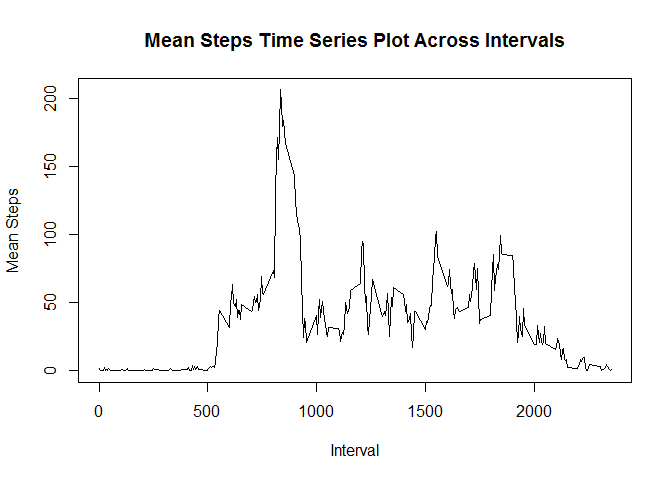

# Reproducible Research: Peer Assessment 1
This document will attempt to answer several questions as they relate to the [Activity Monitoring Date](https://d396qusza40orc.cloudfront.net/repdata%2Fdata%2Factivity.zip);

1. What is the mean total number of steps taken per day?
2. What is the average daily activity?
3. Are there differences in activity patterns between weekdays and weekends?

## Loading and preprocessing the data

```r
library(plyr)
data <- read.csv("activity/activity.csv")
data[, "date"] <- as.Date(data[, "date"], "%Y-%m-%d")
```


## What is mean total number of steps taken per day?

```r
meantotal <- ddply(data, 'date', summarize, total=sum(steps))
hist(meantotal$total, main="Total Number of Steps Taken Each Day", xlab="Steps")
```

 

```r
meansteps <- mean(meantotal$total, na.rm=TRUE)
mediansteps <- median(meantotal$total, na.rm=TRUE)
```


The median total number of steps taken is 10765, and the mean total number of steps taken is 10766.189.

## What is the average daily activity pattern?


```r
meanavg <- ddply(data, 'interval', summarize, average=mean(steps, na.rm=TRUE))
plot(meanavg$interval, meanavg$average, type="l", xlab="Interval", ylab="Mean Steps", main="Mean Steps Time Series Plot Across Intervals" )
```

 

```r
sorted <- arrange(meanavg, desc(average))
maxinterval <- sorted[1,"interval"]
```


The interval with the average maximum number of steps taken is 835.

## Imputing missing values


```r
missing <- sum(is.na(data$steps))
total <- length(data$steps)
```

The number of intervals with missing data is 2304 out of a total of 17568. 


```r
newdata <- data

for(i in 1:nrow(newdata)){
  datarow <- newdata[i,]
  if(is.na(datarow$steps)){
    newdata[i, "steps"] <- meanavg[meanavg$interval == datarow$interval, "average"]
  }
}

meantotalrev <- ddply(newdata, 'date', summarize, total=sum(steps))
hist(meantotalrev$total, main="Total Number of Steps Taken Each Day", xlab="Steps")
```

 

```r
meanstepsrev <- mean(meantotalrev$total, na.rm=TRUE)
medianstepsrev <- median(meantotalrev$total, na.rm=TRUE)
```


The median total number of steps taken is 10766.189, and the mean total number of steps taken is 10766.189.

By replacing the missing values with the mean for that interval, we have shifted the median a small amount, while the mean has stayed the same.  As for the distribution we have increased the frequency of intervals that contain between 10,000 and 15,000 steps.

## Are there differences in activity patterns between weekdays and weekends?


```r
newdata <- cbind(newdata, weekend = as.factor(ifelse(weekdays(newdata$date) %in% c("Saturday","Sunday"), "weekend", "weekday")))

meanavg <- ddply(newdata, c("interval", "weekend"), summarize, average=mean(steps, na.rm=TRUE))

library(lattice)
xyplot(average~interval|weekend, data=meanavg, layout=c(1,2), type="l", xlab="Interval", ylab="Number of steps")
```

 
